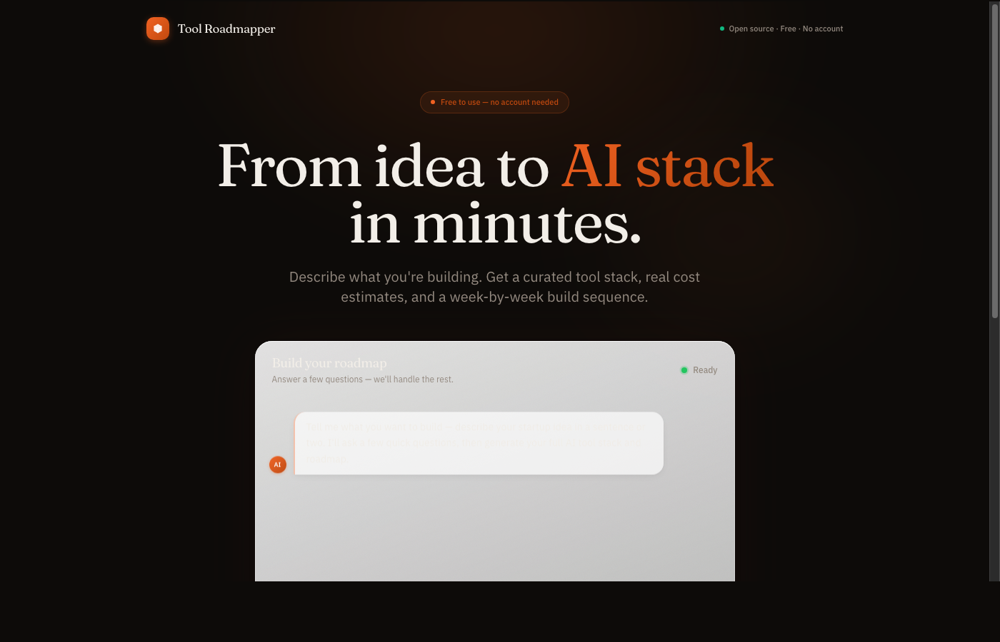

# AI Tool Roadmapper

**From idea to AI stack in minutes.**

AI Tool Roadmapper is an open-source tool that helps founders and developers discover the best AI tools for their startup. Describe your idea in plain English, chat with Claude to refine your requirements, and receive a complete AI tool stack recommendation with a visual interactive roadmap — showing what to build when, estimated costs, and alternatives.



[](https://opensource.org/licenses/MIT)
[](https://nextjs.org)
[](https://supabase.com)
[](https://anthropic.com)
[](#)

---

## Features

- **Conversational requirements gathering** — Claude asks the right questions to understand your use case, team size, and budget before making any recommendations.
- **Curated tool database** — A vetted, categorized database of AI tools (LLMs, embedding models, vector databases, orchestration frameworks, and more) with pricing and capability metadata.
- **Visual interactive roadmap** — A React Flow graph showing your recommended stack organized by phase, with dependency arrows and timeline guidance.
- **Cost estimation** — Per-tool and total stack cost estimates based on your expected usage.
- **Alternatives** — Every recommendation includes alternatives so you can make informed trade-offs.
- **Export** — Copy or download your roadmap as structured data.
- **Background ingestion** — Inngest-powered jobs keep the tool database fresh by ingesting from GitHub, Product Hunt, and curated directories.

---

## How It Works

1. **Describe** — Type a brief description of your startup idea or the problem you are solving.
2. **Chat** — Claude asks targeted clarifying questions: your technical constraints, team size, budget, timeline, and must-have integrations.
3. **Generate** — The planner service queries the vector database, scores tools against your requirements, and produces a phased roadmap.
4. **Export** — Share or save your personalized AI stack recommendation.

---

## Tech Stack

| Layer | Technology |
|---|---|
| **Frontend** | Next.js 14, React 18, TypeScript, Tailwind CSS |
| **Graph Visualization** | React Flow (`@xyflow/react`) |
| **AI / LLM** | Anthropic Claude via Vercel AI SDK |
| **Database** | Supabase (PostgreSQL + pgvector) |
| **ORM** | Drizzle ORM |
| **Background Jobs** | Inngest |
| **Monorepo** | Turborepo + pnpm workspaces |
| **Deployment** | Vercel (web), Supabase (DB) |

### Monorepo Services

| Package / Service | Purpose |
|---|---|
| `apps/web` | Next.js application and API routes |
| `packages/db` | Drizzle schema, migrations, Supabase client |
| `packages/prompts` | Shared Claude prompt templates |
| `packages/schemas` | Shared Zod schemas |
| `packages/scoring` | Tool scoring and ranking logic |
| `services/enrich` | Tool metadata enrichment (classifier, deduplicator) |
| `services/ingest` | Data ingestion from GitHub, Product Hunt, directories |
| `services/planner` | Roadmap generation and tool retrieval |

---

## Getting Started

### Prerequisites

- [Node.js](https://nodejs.org) 20 or later
- [pnpm](https://pnpm.io) 10 or later (`npm install -g pnpm`)
- A [Supabase](https://supabase.com) account (free tier works)
- An [Anthropic API key](https://console.anthropic.com)
- An [Inngest](https://inngest.com) account (free tier works for local dev)

### 1. Clone the repository

```bash
git clone https://github.com/nolanselby/stackmap.git
cd ai-tool-roadmapper
```

---

## Tool Database & Public Data

This project is built to serve as a **public, crowdsourced database of AI tools**.

### Accessing the Data
- **Structured Schema**: The Postgres schema for all tools, pricing, and capabilities is located in [`packages/db/src/schema.ts`](packages/db/src/schema.ts).
- **Seeding**: You can populate your own instance of the database using the scripts in `scripts/bulk-seed.ts`.
- **Enrichment Logic**: The logic for how tools are classified and scored is open-source in `services/enrich` and `packages/scoring`.

### Contributing Tools
If you'd like to add a tool to the global database, please submit a PR with a new staging record or use the built-in scraper ingestion functions.

### 2. Install dependencies

```bash
pnpm install
```

### 3. Configure environment variables

```bash
cp apps/web/.env.local.example apps/web/.env.local
```

Open `apps/web/.env.local` and fill in your keys. See [Environment Variables](#environment-variables) below.

### 4. Set up Supabase

Follow the step-by-step guide in [docs/setup-supabase.md](docs/setup-supabase.md) to:

- Create a Supabase project
- Enable the `pgvector` extension
- Run the database migrations
- Copy your connection strings into `.env.local`

### 5. Run the development server

```bash
pnpm dev
```

The app will be available at [http://localhost:3000](http://localhost:3000).

To run all services in parallel with Turborepo:

```bash
pnpm dev:all
```

---

## Project Structure

```
ai-tool-roadmapper/
├── apps/
│   └── web/                     # Next.js 14 application
│       ├── app/                 # App Router pages and API routes
│       ├── components/          # React components (chat, roadmap)
│       └── inngest/             # Inngest function definitions
├── packages/
│   ├── db/                      # Drizzle ORM schema and Supabase client
│   │   └── supabase/migrations/ # SQL migration files
│   ├── prompts/                 # Shared Claude prompt templates
│   ├── schemas/                 # Shared Zod validation schemas
│   └── scoring/                 # Tool scoring and ranking algorithms
├── services/
│   ├── enrich/                  # Tool enrichment (classify, deduplicate)
│   ├── ingest/                  # Data ingestion (GitHub, Product Hunt, dirs)
│   └── planner/                 # Roadmap generation and retrieval
├── scripts/                     # Utility scripts (seeding, etc.)
├── docs/                        # Additional documentation
├── package.json                 # Root workspace manifest
├── pnpm-workspace.yaml          # pnpm workspace configuration
└── turbo.json                   # Turborepo pipeline configuration
```

---

## Environment Variables

All required environment variables are documented in [`apps/web/.env.local.example`](apps/web/.env.local.example).

| Variable | Required | Description |
|---|---|---|
| `ANTHROPIC_API_KEY` | Yes | Your Anthropic API key |
| `NEXT_PUBLIC_SUPABASE_URL` | Yes | Your Supabase project URL |
| `NEXT_PUBLIC_SUPABASE_ANON_KEY` | Yes | Supabase anonymous (public) key |
| `SUPABASE_SERVICE_ROLE_KEY` | Yes | Supabase service role key (server-only) |
| `DATABASE_URL` | Yes | PostgreSQL connection string |
| `INNGEST_EVENT_KEY` | Yes | Inngest event key |
| `INNGEST_SIGNING_KEY` | Yes | Inngest signing key |
| `NEXT_PUBLIC_APP_URL` | No | Public app URL (defaults to localhost:3000) |

---

## Contributing

Contributions are very welcome! Whether you want to fix a bug, improve the docs, add a new AI tool to the database, or propose a new feature — please read [CONTRIBUTING.md](CONTRIBUTING.md) first.

---

## License

This project is licensed under the MIT License. See [LICENSE](LICENSE) for details.

---

## Acknowledgements

- [Anthropic](https://anthropic.com) for Claude and the AI SDK
- [Supabase](https://supabase.com) for the database and pgvector support
- [Vercel](https://vercel.com) for Next.js and deployment infrastructure
- [Inngest](https://inngest.com) for background job orchestration
- [React Flow](https://reactflow.dev) for the interactive graph visualization
